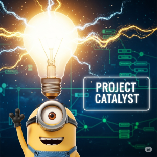

## What would you like Project Catalyst to do?
Describe the feature or improvement you'd like to see.

## What problem would this solve?
Explain what learning challenge or limitation this would address.

## How would it work?
Give a simple example of how you'd use this feature.

**Example:**
"When I'm learning about [topic], I would [do this action] and Project Catalyst would [respond this way]."

## Alternatives you've considered
Any other ways to solve this problem that you've thought about.

## How important is this to you?
- [ ] Would be nice to have
- [ ] Would significantly improve my learning
- [ ] Essential for my use case

## Additional context
Anything else that would help explain your request.
