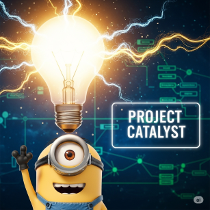

## Research Paper/Study
**Title:** [Name of the research paper or study]
**Authors:** [Who conducted the research]
**Year:** [When was it published]
**Link:** [URL or DOI if available]

## What does this research show?
Summarize the main findings in simple terms.

## How could this help Project Catalyst?
Explain how this research could make Project Catalyst better at helping people learn.

**Example:** "This study shows that people learn better when they take breaks every 25 minutes. Project Catalyst could suggest breaks during long learning sessions."

## Research Quality
- [ ] Published in academic journal (peer-reviewed)
- [ ] Conference paper
- [ ] Preprint/early version
- [ ] Book or textbook
- [ ] Other: [specify]

## Additional notes
Any other details about how this research relates to learning or cognitive science.
