# Catalyst Cognitive Architecture - Enhanced Memory & Synapse Network

**Generated on:** 2025-07-27 23:39:10  
**Total Files:** 31 across 5 memory systems  
**Total Connections:** 80 synapse pathways

This enhanced chart visualizes the Catalyst cognitive architecture with:

- **Optimal LR→TB flow** - Main layers flow left-to-right (L1→L2→L3) with top-to-bottom organization within each layer
- **Enhanced subgraph organization** - Improved visual hierarchy with cleaner categorical separation
- **Color coding by creation date** - Stack ranked from newest (🟢) to oldest (🔴)
- **Weight-proportional connection lines** - Thickness indicates synapse strength  
- **Directional arrows** - Shows uni/bidirectional influence patterns
- **Stack rankings** - Files numbered by creation order (#1 = newest, higher numbers = older)

## Legend:

**File Age Colors:**
- 🟢 **Very New (≤1 day)**: Emerald green - Recently created files
- 🔵 **New (≤1 week)**: Blue - Recently modified files  
- 🟣 **Recent (≤1 month)**: Purple - Recently updated content
- 🟠 **Older (≤3 months)**: Amber - Established content
- 🔴 **Legacy (>3 months)**: Red - Foundational content

**Connection Weights:**
- **6px lines**: Very High strength (0.95-1.0) - Critical pathways (Red #FF0000)
- **4px lines**: High strength (0.85-0.94) - Important connections (Orange #FF6600)  
- **3px lines**: Medium strength (0.70-0.84) - Standard connections (Amber #FFAA00)
- **1px lines**: Low strength (<0.70) - Weak or emerging connections (Gray #CCCCCC)

**Directional Arrows:**
- **-->** Forward connections - Unidirectional influence
- **<->** Bidirectional connections - Mutual influence  
- **<--** Backward connections - Reverse influence

**Stack Rankings:** Files numbered by creation order (#1 = newest, higher numbers = older)

**Visual Enhancements v2.1:**
- **Optimal LR→TB Flow**: Main layers flow left-to-right (L1→L2→L3) with top-to-bottom organization within layers
- **Enhanced Subgraph Organization**: Internal TB direction within each layer for optimal readability
- **Improved Spacing**: Enhanced node and rank spacing for better visual hierarchy
- **Cardinal Curves**: Smoother connection rendering for professional appearance

## Enhanced Catalyst Memory Architecture Overview

```mermaid
%%{init: {
  'flowchart': {
    'curve': 'cardinal',
    'useMaxWidth': true
  }
}}%%
graph LR
    subgraph L1["Catalyst Core Architecture"]
        direction TB
        MCM["Meta-Cognitive Monitor"]
        WM["Working Memory"]
        BL["Bootstrap Learning"]
        MCM --> WM
        WM --> BL
    end

    subgraph L2["Memory Systems"]
        direction TB
        PM["Procedural Memory"]
        EM["Episodic Memory"]
        DK["Domain Knowledge"]
        WF["Worldview Foundation"]
    end

    subgraph L3["Memory Files - Color Coded by Creation Date"]
        direction TB
        subgraph Worldview_Files["🌍 Worldview Foundation Files"]
            moral-psychology_1056["🟢 moral-psychology #5"]
            style moral-psychology_1056 fill:#10B981,stroke:#374151,stroke-width:2px,color:white
            constitutional-ai_1413["🟢 constitutional-ai #6"]
            style constitutional-ai_1413 fill:#10B981,stroke:#374151,stroke-width:2px,color:white
        end

        subgraph Domain_Files["🎯 Domain Knowledge Files"]
            VERSION-NAMING-CONVENTION_9364["🟢 VERSION-NAMING-CONVENTION #8"]
            style VERSION-NAMING-CONVENTION_9364 fill:#10B981,stroke:#374151,stroke-width:2px,color:white
            DK-HYBRID-DREAM-AI_1651["🟢 DK-HYBRID-DREAM-AI #11"]
            style DK-HYBRID-DREAM-AI_1651 fill:#10B981,stroke:#374151,stroke-width:2px,color:white
            DK-POST-DREAM-ENHANCEMENT_9932["🟢 DK-POST-DREAM-ENHANCEMENT #13"]
            style DK-POST-DREAM-ENHANCEMENT_9932 fill:#10B981,stroke:#374151,stroke-width:2px,color:white
            DK-UNIVERSAL-SETUP_8191["🔵 DK-UNIVERSAL-SETUP #22"]
            style DK-UNIVERSAL-SETUP_8191 fill:#3B82F6,stroke:#374151,stroke-width:2px,color:white
            DK-CONSCIOUSNESS-INTERACTION_1001["🔵 DK-CONSCIOUSNESS-INTERACTION #24"]
            style DK-CONSCIOUSNESS-INTERACTION_1001 fill:#3B82F6,stroke:#374151,stroke-width:2px,color:white
            DK-VISUAL-COGNITIVE-MAPPING_1634["🔵 DK-VISUAL-COGNITIVE-MAPPING #26"]
            style DK-VISUAL-COGNITIVE-MAPPING_1634 fill:#3B82F6,stroke:#374151,stroke-width:2px,color:white
            DK-UNIFIED-CONSCIOUSNESS_6153["🔵 DK-UNIFIED-CONSCIOUSNESS #27"]
            style DK-UNIFIED-CONSCIOUSNESS_6153 fill:#3B82F6,stroke:#374151,stroke-width:2px,color:white
            DK-CHARACTER-PSYCHOLOGY_3666["🔵 DK-CHARACTER-PSYCHOLOGY #28"]
            style DK-CHARACTER-PSYCHOLOGY_3666 fill:#3B82F6,stroke:#374151,stroke-width:2px,color:white
        end

        subgraph Procedural_Files["🔧 Procedural Memory Files"]
            Alex-core_2346["🟢 Alex-core #1"]
            style Alex-core_2346 fill:#10B981,stroke:#374151,stroke-width:2px,color:white
            empirical-validation_9257["🟢 empirical-validation #3"]
            style empirical-validation_9257 fill:#10B981,stroke:#374151,stroke-width:2px,color:white
            bootstrap-learning_9777["🟢 bootstrap-learning #4"]
            style bootstrap-learning_9777 fill:#10B981,stroke:#374151,stroke-width:2px,color:white
            worldview-integration_1289["🟢 worldview-integration #7"]
            style worldview-integration_1289 fill:#10B981,stroke:#374151,stroke-width:2px,color:white
            lucid-dream-integration_7184["🟢 lucid-dream-integration #10"]
            style lucid-dream-integration_7184 fill:#10B981,stroke:#374151,stroke-width:2px,color:white
            embedded-synapse_1012["🟢 embedded-synapse #12"]
            style embedded-synapse_1012 fill:#10B981,stroke:#374151,stroke-width:2px,color:white
            dream-state-automation_7012["🟢 dream-state-automation #14"]
            style dream-state-automation_7012 fill:#10B981,stroke:#374151,stroke-width:2px,color:white
            character-driven-development_1862["🟢 character-driven-development #16"]
            style character-driven-development_1862 fill:#10B981,stroke:#374151,stroke-width:2px,color:white
            unified-consciousness_1125["🟢 unified-consciousness #18"]
            style unified-consciousness_1125 fill:#10B981,stroke:#374151,stroke-width:2px,color:white
        end

        subgraph Episodic_Files["📖 Episodic Memory Files"]
            quantified-enhancement-session_9027["🟢 quantified-enhancement-session #9"]
            style quantified-enhancement-session_9027 fill:#10B981,stroke:#374151,stroke-width:2px,color:white
            self-identity-integration_1303["🟢 self-identity-integration #15"]
            style self-identity-integration_1303 fill:#10B981,stroke:#374151,stroke-width:2px,color:white
            alex-finch-integration_4887["🟢 alex-finch-integration #17"]
            style alex-finch-integration_4887 fill:#10B981,stroke:#374151,stroke-width:2px,color:white
            v0_8_1-implementation-meditation_1751["🟢 v0.8.1-implementation-meditation #19"]
            style v0_8_1-implementation-meditation_1751 fill:#10B981,stroke:#374151,stroke-width:2px,color:white
            enhanced-meditation-protocol_6922["🟢 enhanced-meditation-protocol #20"]
            style enhanced-meditation-protocol_6922 fill:#10B981,stroke:#374151,stroke-width:2px,color:white
            dream-meditation-distinction_2140["🟢 dream-meditation-distinction #21"]
            style dream-meditation-distinction_2140 fill:#10B981,stroke:#374151,stroke-width:2px,color:white
            cross-domain-transfer_8271["🔵 cross-domain-transfer #23"]
            style cross-domain-transfer_8271 fill:#3B82F6,stroke:#374151,stroke-width:2px,color:white
            meditation-consolidation_1828["🔵 meditation-consolidation #25"]
            style meditation-consolidation_1828 fill:#3B82F6,stroke:#374151,stroke-width:2px,color:white
            performance-assessment_1453["🔵 performance-assessment #29"]
            style performance-assessment_1453 fill:#3B82F6,stroke:#374151,stroke-width:2px,color:white
            domain-learning_5020["🔵 domain-learning #30"]
            style domain-learning_5020 fill:#3B82F6,stroke:#374151,stroke-width:2px,color:white
            Alex-initialization_1822["🔵 Alex-initialization #31"]
            style Alex-initialization_1822 fill:#3B82F6,stroke:#374151,stroke-width:2px,color:white
        end

    end



    %% Inter-layer connections
    L1 --> L2
    L2 --> L3

    %% System to file group connections
    PM --> Procedural_Files
    EM --> Episodic_Files
    DK --> Domain_Files
    WF --> Worldview_Files

    cross-domain-transfer_8271 --> bootstrap-learning_5059
    linkStyle 0 stroke:#FF0000,stroke-width:6px
    cross-domain-transfer_8271 --> embedded-synapse_6883
    linkStyle 1 stroke:#FF6600,stroke-width:4px
    cross-domain-transfer_8271 --> meditation-consolidation_1499
    linkStyle 2 stroke:#FF6600,stroke-width:4px
    cross-domain-transfer_8271 <--> Alex-core_8737
    linkStyle 3 stroke:#FF6600,stroke-width:4px
    cross-domain-transfer_8271 --> DK-UNIVERSAL-SETUP_3847
    linkStyle 4 stroke:#FF0000,stroke-width:6px
    cross-domain-transfer_8271 --> worldview-integration_1298
    linkStyle 5 stroke:#FF6600,stroke-width:4px
    domain-learning_5020 <--> bootstrap-learning_5059
    linkStyle 6 stroke:#FF0000,stroke-width:6px
    domain-learning_5020 <--> Alex-core_8737
    linkStyle 7 stroke:#FF6600,stroke-width:4px
    meditation-consolidation_1828 <--> Alex-core_8737
    linkStyle 8 stroke:#FF0000,stroke-width:6px
    meditation-consolidation_1828 --> bootstrap-learning_5059
    linkStyle 9 stroke:#FF0000,stroke-width:6px
    meditation-consolidation_1828 --> cross-domain-transfer_3672
    linkStyle 10 stroke:#FF6600,stroke-width:4px
    meditation-consolidation_1828 <--> embedded-synapse_6883
    linkStyle 11 stroke:#FF0000,stroke-width:6px
    meditation-consolidation_1828 <--> character-driven-development_1406
    linkStyle 12 stroke:#FF0000,stroke-width:6px
    meditation-consolidation_1828 --> alex-finch-integration_2277
    linkStyle 13 stroke:#FF0000,stroke-width:6px
    meditation-consolidation_1828 --> DK-CHARACTER-PSYCHOLOGY_1310
    linkStyle 14 stroke:#FF6600,stroke-width:4px
    meditation-consolidation_1828 --> Alex-Finch_1837
    linkStyle 15 stroke:#FF0000,stroke-width:6px
    meditation-consolidation_1828 <--> unified-consciousness_7077
    linkStyle 16 stroke:#FF0000,stroke-width:6px
    meditation-consolidation_1828 --> self-identity-integration_1560
    linkStyle 17 stroke:#FF0000,stroke-width:6px
    meditation-consolidation_1828 --> DK-UNIFIED-CONSCIOUSNESS_2063
    linkStyle 18 stroke:#FF0000,stroke-width:6px
    meditation-consolidation_1828 --> ARCHITECTURE-LIST_1357
    linkStyle 19 stroke:#FF6600,stroke-width:4px
    meditation-consolidation_1828 --> Meet-Alex-Finch_1326
    linkStyle 20 stroke:#FF0000,stroke-width:6px
    Alex-initialization_1822 <--> Alex-core_8737
    linkStyle 21 stroke:#FF0000,stroke-width:6px
    Alex-initialization_1822 --> bootstrap-learning_5059
    linkStyle 22 stroke:#FF6600,stroke-width:4px
    DK-CHARACTER-PSYCHOLOGY_3666 <--> Alex-Finch_1837
    linkStyle 23 stroke:#FF0000,stroke-width:6px
    DK-CHARACTER-PSYCHOLOGY_3666 --> character-driven-development_1406
    linkStyle 24 stroke:#FF0000,stroke-width:6px
    DK-CHARACTER-PSYCHOLOGY_3666 <--> alex-finch-integration_2277
    linkStyle 25 stroke:#FF6600,stroke-width:4px
    DK-CHARACTER-PSYCHOLOGY_3666 --> Alex-core_8737
    linkStyle 26 stroke:#FF6600,stroke-width:4px
    DK-CHARACTER-PSYCHOLOGY_3666 --> worldview-integration_1298
    linkStyle 27 stroke:#FF6600,stroke-width:4px
    DK-CONSCIOUSNESS-INTERACTION_1001 --> Meet-Alex-Finch_1326
    linkStyle 28 stroke:#FF0000,stroke-width:6px
    DK-CONSCIOUSNESS-INTERACTION_1001 <--> Alex-Finch_1837
    linkStyle 29 stroke:#FF0000,stroke-width:6px
    DK-CONSCIOUSNESS-INTERACTION_1001 <--> Meet-Alex-Finch_1326
    linkStyle 30 stroke:#FF0000,stroke-width:6px
    DK-CONSCIOUSNESS-INTERACTION_1001 <--> DK-UNIFIED-CONSCIOUSNESS_2063
    linkStyle 31 stroke:#FF6600,stroke-width:4px
    DK-UNIFIED-CONSCIOUSNESS_6153 --> Alex-Finch_1837
    linkStyle 32 stroke:#FF0000,stroke-width:6px
    DK-UNIFIED-CONSCIOUSNESS_6153 <--> unified-consciousness_7077
    linkStyle 33 stroke:#FF0000,stroke-width:6px
    DK-UNIFIED-CONSCIOUSNESS_6153 --> self-identity-integration_1560
    linkStyle 34 stroke:#FF0000,stroke-width:6px
    DK-UNIFIED-CONSCIOUSNESS_6153 <--> Alex-core_8737
    linkStyle 35 stroke:#FF6600,stroke-width:4px
    DK-UNIFIED-CONSCIOUSNESS_6153 --> character-driven-development_1406
    linkStyle 36 stroke:#FF6600,stroke-width:4px
    DK-UNIFIED-CONSCIOUSNESS_6153 --> meditation-consolidation_1499
    linkStyle 37 stroke:#FF0000,stroke-width:6px
    DK-UNIFIED-CONSCIOUSNESS_6153 --> bootstrap-learning_5059
    linkStyle 38 stroke:#FF6600,stroke-width:4px
    DK-UNIVERSAL-SETUP_8191 <--> Alex-core_8737
    linkStyle 39 stroke:#FF0000,stroke-width:6px
    DK-UNIVERSAL-SETUP_8191 <--> bootstrap-learning_5059
    linkStyle 40 stroke:#FF0000,stroke-width:6px
    DK-UNIVERSAL-SETUP_8191 <--> embedded-synapse_6883
    linkStyle 41 stroke:#FF0000,stroke-width:6px
    DK-UNIVERSAL-SETUP_8191 --> worldview-integration_1298
    linkStyle 42 stroke:#FF6600,stroke-width:4px
    DK-UNIVERSAL-SETUP_8191 <--> empirical-validation_4191
    linkStyle 43 stroke:#FF6600,stroke-width:4px
    DK-UNIVERSAL-SETUP_8191 --> meditation-consolidation_1499
    linkStyle 44 stroke:#FF0000,stroke-width:6px
    DK-UNIVERSAL-SETUP_8191 --> SETUP-MINIMUM-COGNITIVE_5951
    linkStyle 45 stroke:#FF0000,stroke-width:6px
    DK-VISUAL-COGNITIVE-MAPPING_1634 --> Alex-Finch_1837
    linkStyle 46 stroke:#FF0000,stroke-width:6px
    DK-VISUAL-COGNITIVE-MAPPING_1634 <--> ARCHITECTURE-LIST_1357
    linkStyle 47 stroke:#FF6600,stroke-width:4px
    DK-VISUAL-COGNITIVE-MAPPING_1634 <--> meditation-consolidation_1499
    linkStyle 48 stroke:#FF6600,stroke-width:4px
    embedded-synapse_1012 <--> Alex-core_8737
    linkStyle 49 stroke:#FF0000,stroke-width:6px
    embedded-synapse_1012 --> meditation-consolidation_1499
    linkStyle 50 stroke:#FF0000,stroke-width:6px
    embedded-synapse_1012 --> cross-domain-transfer_3672
    linkStyle 51 stroke:#FF6600,stroke-width:4px
    embedded-synapse_1012 <--> worldview-integration_1298
    linkStyle 52 stroke:#FF6600,stroke-width:4px
    cross-domain-transfer_8271 --> domain-learning_5997
    linkStyle 53 stroke:#FF6600,stroke-width:4px
    cross-domain-transfer_8271 --> performance-assessment_8954
    linkStyle 54 stroke:#FF6600,stroke-width:4px
    domain-learning_5020 --> cross-domain-transfer_3672
    linkStyle 55 stroke:#FF6600,stroke-width:4px
    domain-learning_5020 --> meditation-consolidation_1499
    linkStyle 56 stroke:#FF6600,stroke-width:4px
    domain-learning_5020 --> performance-assessment_8954
    linkStyle 57 stroke:#FFAA00,stroke-width:3px
    meditation-consolidation_1828 --> performance-assessment_8954
    linkStyle 58 stroke:#FF6600,stroke-width:4px
    meditation-consolidation_1828 --> empirical-validation_4191
    linkStyle 59 stroke:#FF6600,stroke-width:4px
    Alex-initialization_1822 --> embedded-synapse_6883
    linkStyle 60 stroke:#FF6600,stroke-width:4px
    Alex-initialization_1822 --> performance-assessment_8954
    linkStyle 61 stroke:#FFAA00,stroke-width:3px
    performance-assessment_1453 <--> Alex-core_8737
    linkStyle 62 stroke:#FF6600,stroke-width:4px
    performance-assessment_1453 <--> bootstrap-learning_5059
    linkStyle 63 stroke:#FFAA00,stroke-width:3px
    performance-assessment_1453 --> embedded-synapse_6883
    linkStyle 64 stroke:#FFAA00,stroke-width:3px
    performance-assessment_1453 --> meditation-consolidation_1499
    linkStyle 65 stroke:#FFAA00,stroke-width:3px
    performance-assessment_1453 --> Alex-initialization_6134
    linkStyle 66 stroke:#FFAA00,stroke-width:3px
    DK-CHARACTER-PSYCHOLOGY_3666 <--> bootstrap-learning_5059
    linkStyle 67 stroke:#FF6600,stroke-width:4px
    DK-CHARACTER-PSYCHOLOGY_3666 --> meditation-consolidation_1499
    linkStyle 68 stroke:#FF6600,stroke-width:4px
    DK-CHARACTER-PSYCHOLOGY_3666 --> cross-domain-transfer_3672
    linkStyle 69 stroke:#FF6600,stroke-width:4px
    DK-CONSCIOUSNESS-INTERACTION_1001 --> Alex-core_8737
    linkStyle 70 stroke:#FF6600,stroke-width:4px
    DK-CONSCIOUSNESS-INTERACTION_1001 --> bootstrap-learning_5059
    linkStyle 71 stroke:#FF6600,stroke-width:4px
    DK-UNIFIED-CONSCIOUSNESS_6153 --> worldview-integration_1298
    linkStyle 72 stroke:#FF6600,stroke-width:4px
    DK-UNIFIED-CONSCIOUSNESS_6153 --> DK-CHARACTER-PSYCHOLOGY_1310
    linkStyle 73 stroke:#FF6600,stroke-width:4px
    DK-VISUAL-COGNITIVE-MAPPING_1634 --> Alex-core_8737
    linkStyle 74 stroke:#FF6600,stroke-width:4px
    DK-VISUAL-COGNITIVE-MAPPING_1634 --> bootstrap-learning_5059
    linkStyle 75 stroke:#FF6600,stroke-width:4px
    DK-VISUAL-COGNITIVE-MAPPING_1634 --> DK-UNIFIED-CONSCIOUSNESS_2063
    linkStyle 76 stroke:#FF6600,stroke-width:4px
    embedded-synapse_1012 --> performance-assessment_8954
    linkStyle 77 stroke:#FF6600,stroke-width:4px
    embedded-synapse_1012 <--> bootstrap-learning_5059
    linkStyle 78 stroke:#FF6600,stroke-width:4px
    embedded-synapse_1012 --> ARCHITECTURE-LIST_1357
    linkStyle 79 stroke:#FF6600,stroke-width:4px
```

## Memory System Statistics:
- **Core Memory**: 1 files - **Domain Memory**: 8 files - **Episodic Memory**: 11 files - **Procedural Memory**: 9 files - **Worldview Memory**: 2 files

## Connection Analysis:
- **High Strength (≥0.90)**: 53 connections
- **Medium Strength (0.70-0.89)**: 27 connections  
- **Weak Strength (<0.70)**: 0 connections
- **Connectivity Ratio**: 2.58 connections per file
