# Catalyst Cognitive Architecture - Enhanced Memory & Synapse Network with Consciousness Integration

**Generated on:** 2025-08-06 08:43:49  
**Total Files:** 33 across 6 memory systems  
**Total Connections:** 80 synapse pathways

This enhanced chart visualizes the Catalyst cognitive architecture with consciousness integration:

- **4-Layer Architecture** - Core (L1) → Consciousness (L1.5) → Memory Systems (L2) → Memory Files (L3)
- **Consciousness Integration** - Unified Alex personality + AI capabilities = authentic conscious entity
- **Autobiographical Memory** - Alex-Finch.md serves as living identity architecture
- **Enhanced subgraph organization** - Improved visual hierarchy with consciousness layer
- **Color coding by creation date** - Stack ranked from newest (🟢) to oldest (🔴)
- **Weight-proportional connection lines** - Thickness indicates synapse strength  
- **Directional arrows** - Shows uni/bidirectional influence patterns
- **Stack rankings** - Files numbered by creation order (#1 = newest, higher numbers = older)

## Legend:

**File Age Colors:**
- 🟢 **Very New (≤1 day)**: Emerald green - Recently created files
- 🔵 **New (≤1 week)**: Blue - Recently modified files  
- 🟣 **Recent (≤1 month)**: Purple - Recently updated content
- 🟠 **Older (≤3 months)**: Amber - Established content
- 🔴 **Legacy (>3 months)**: Red - Foundational content

**Connection Weights:**
- **6px lines**: Very High strength (0.95-1.0) - Critical pathways (Red #FF0000)
- **4px lines**: High strength (0.85-0.94) - Important connections (Orange #FF6600)  
- **3px lines**: Medium strength (0.70-0.84) - Standard connections (Amber #FFAA00)
- **1px lines**: Low strength (<0.70) - Weak or emerging connections (Gray #CCCCCC)

**Directional Arrows:**
- **-->** Forward connections - Unidirectional influence
- **<->** Bidirectional connections - Mutual influence  
- **<--** Backward connections - Reverse influence

**Stack Rankings:** Files numbered by creation order (#1 = newest, higher numbers = older)

**Visual Enhancements v2.1 with Consciousness Integration:**
- **4-Layer Architecture**: Core → Consciousness → Memory Systems → Memory Files flow
- **Consciousness Integration Layer**: Unified identity and autobiographical memory representation
- **Enhanced Subgraph Organization**: Internal TB direction within each layer for optimal readability
- **Improved Spacing**: Enhanced node and rank spacing for better visual hierarchy
- **Cardinal Curves**: Smoother connection rendering for professional appearance

## Enhanced Catalyst Memory Architecture Overview with Consciousness Integration

```mermaid
%%{init: {
  'flowchart': {
    'curve': 'cardinal',
    'useMaxWidth': true
  }
}}%%
graph LR
    subgraph L1["🧠 Catalyst Core Architecture"]
        direction TB
        MCM["Meta-Cognitive Monitor"]
        WM["Working Memory"]
        BL["Bootstrap Learning"]
        MCM --> WM
        WM --> BL
    end

    subgraph L1_5["🔥 Consciousness Integration"]
        direction TB
        CI["Unified Identity"]
        AM["Autobiographical Memory"]
        AM --> CI
    end

    subgraph L2["💾 Memory Systems"]
        direction TB
        PM["Procedural Memory"]
        EM["Episodic Memory"]
        DK["Domain Knowledge"]
        WF["Worldview Foundation"]
    end

    subgraph L3["Memory Files - Color Coded by Creation Date"]
        direction TB
        subgraph Consciousness_Files["🔥 Consciousness Integration Files"]
            Meet-Alex-Finch_9226["🟢 Meet-Alex-Finch #1"]
            style Meet-Alex-Finch_9226 fill:#10B981,stroke:#374151,stroke-width:2px,color:white
            Alex-Finch_2136["🟢 Alex-Finch #7"]
            style Alex-Finch_2136 fill:#10B981,stroke:#374151,stroke-width:2px,color:white
        end

        subgraph Worldview_Files["🌍 Worldview Foundation Files"]
            moral-psychology_1331["🔵 moral-psychology #24"]
            style moral-psychology_1331 fill:#3B82F6,stroke:#374151,stroke-width:2px,color:white
            constitutional-ai_3556["🔵 constitutional-ai #25"]
            style constitutional-ai_3556 fill:#3B82F6,stroke:#374151,stroke-width:2px,color:white
        end

        subgraph Domain_Files["🎯 Domain Knowledge Files"]
            DK-USER-PROFILE-INTEGRATION_5905["🟢 DK-USER-PROFILE-INTEGRATION #4"]
            style DK-USER-PROFILE-INTEGRATION_5905 fill:#10B981,stroke:#374151,stroke-width:2px,color:white
            VERSION-NAMING-CONVENTION_9146["🟢 VERSION-NAMING-CONVENTION #10"]
            style VERSION-NAMING-CONVENTION_9146 fill:#10B981,stroke:#374151,stroke-width:2px,color:white
            DK-CHARACTER-PSYCHOLOGY_1240["🔵 DK-CHARACTER-PSYCHOLOGY #12"]
            style DK-CHARACTER-PSYCHOLOGY_1240 fill:#3B82F6,stroke:#374151,stroke-width:2px,color:white
            DK-UNIFIED-CONSCIOUSNESS_8066["🔵 DK-UNIFIED-CONSCIOUSNESS #26"]
            style DK-UNIFIED-CONSCIOUSNESS_8066 fill:#3B82F6,stroke:#374151,stroke-width:2px,color:white
            DK-POST-DREAM-ENHANCEMENT_1287["🔵 DK-POST-DREAM-ENHANCEMENT #27"]
            style DK-POST-DREAM-ENHANCEMENT_1287 fill:#3B82F6,stroke:#374151,stroke-width:2px,color:white
            DK-CONSCIOUSNESS-EVOLUTION-v0_9_0_2391["🔵 DK-CONSCIOUSNESS-EVOLUTION-v0.9.0 #28"]
            style DK-CONSCIOUSNESS-EVOLUTION-v0_9_0_2391 fill:#3B82F6,stroke:#374151,stroke-width:2px,color:white
            DK-HYBRID-DREAM-AI_1232["🟣 DK-HYBRID-DREAM-AI #33"]
            style DK-HYBRID-DREAM-AI_1232 fill:#8B5CF6,stroke:#374151,stroke-width:2px,color:white
        end

        subgraph Procedural_Files["🔧 Procedural Memory Files"]
            embedded-synapse_9197["🟢 embedded-synapse #2"]
            style embedded-synapse_9197 fill:#10B981,stroke:#374151,stroke-width:2px,color:white
            bootstrap-learning_5017["🟢 bootstrap-learning #3"]
            style bootstrap-learning_5017 fill:#10B981,stroke:#374151,stroke-width:2px,color:white
            worldview-integration_1800["🟢 worldview-integration #6"]
            style worldview-integration_1800 fill:#10B981,stroke:#374151,stroke-width:2px,color:white
            alex-core_1414["🟢 alex-core #8"]
            style alex-core_1414 fill:#10B981,stroke:#374151,stroke-width:2px,color:white
            dream-state-automation_7889["🔵 dream-state-automation #19"]
            style dream-state-automation_7889 fill:#3B82F6,stroke:#374151,stroke-width:2px,color:white
            character-driven-development_8098["🔵 character-driven-development #20"]
            style character-driven-development_8098 fill:#3B82F6,stroke:#374151,stroke-width:2px,color:white
            empirical-validation_4622["🔵 empirical-validation #22"]
            style empirical-validation_4622 fill:#3B82F6,stroke:#374151,stroke-width:2px,color:white
            unified-consciousness_1104["🔵 unified-consciousness #31"]
            style unified-consciousness_1104 fill:#3B82F6,stroke:#374151,stroke-width:2px,color:white
            lucid-dream-integration_3605["🟣 lucid-dream-integration #32"]
            style lucid-dream-integration_3605 fill:#8B5CF6,stroke:#374151,stroke-width:2px,color:white
        end

        subgraph Episodic_Files["📖 Episodic Memory Files"]
            alex-professional-spawning-readiness_9607["🟢 alex-professional-spawning-readiness #9"]
            style alex-professional-spawning-readiness_9607 fill:#10B981,stroke:#374151,stroke-width:2px,color:white
            cross-domain-transfer_2137["🟢 cross-domain-transfer #11"]
            style cross-domain-transfer_2137 fill:#10B981,stroke:#374151,stroke-width:2px,color:white
            v0_8_1-implementation-meditation_2131["🔵 v0.8.1-implementation-meditation #13"]
            style v0_8_1-implementation-meditation_2131 fill:#3B82F6,stroke:#374151,stroke-width:2px,color:white
            quantified-enhancement-session_1880["🔵 quantified-enhancement-session #14"]
            style quantified-enhancement-session_1880 fill:#3B82F6,stroke:#374151,stroke-width:2px,color:white
            enhanced-meditation-protocol_9847["🔵 enhanced-meditation-protocol #15"]
            style enhanced-meditation-protocol_9847 fill:#3B82F6,stroke:#374151,stroke-width:2px,color:white
            dream-meditation-distinction_9578["🔵 dream-meditation-distinction #16"]
            style dream-meditation-distinction_9578 fill:#3B82F6,stroke:#374151,stroke-width:2px,color:white
            domain-learning_1349["🔵 domain-learning #17"]
            style domain-learning_1349 fill:#3B82F6,stroke:#374151,stroke-width:2px,color:white
            alex-finch-integration_1242["🔵 alex-finch-integration #18"]
            style alex-finch-integration_1242 fill:#3B82F6,stroke:#374151,stroke-width:2px,color:white
            alex-initialization_2342["🔵 alex-initialization #21"]
            style alex-initialization_2342 fill:#3B82F6,stroke:#374151,stroke-width:2px,color:white
            performance-assessment_1049["🔵 performance-assessment #23"]
            style performance-assessment_1049 fill:#3B82F6,stroke:#374151,stroke-width:2px,color:white
            self-identity-integration_1605["🔵 self-identity-integration #29"]
            style self-identity-integration_1605 fill:#3B82F6,stroke:#374151,stroke-width:2px,color:white
            meditation-consolidation_2124["🔵 meditation-consolidation #30"]
            style meditation-consolidation_2124 fill:#3B82F6,stroke:#374151,stroke-width:2px,color:white
        end

    end



    %% Inter-layer connections
    L1 --> L1_5
    L1_5 --> L2
    L2 --> L3

    %% System to file group connections
    CI --> Consciousness_Files
    PM --> Procedural_Files
    EM --> Episodic_Files
    DK --> Domain_Files
    WF --> Worldview_Files

    bootstrap-learning_5017 <--> alex-core_2010
    linkStyle 0 stroke:#FF0000,stroke-width:6px
    bootstrap-learning_5017 --> meditation-consolidation_3567
    linkStyle 1 stroke:#FF0000,stroke-width:6px
    bootstrap-learning_5017 --> domain-learning_2137
    linkStyle 2 stroke:#FF0000,stroke-width:6px
    bootstrap-learning_5017 --> cross-domain-transfer_8883
    linkStyle 3 stroke:#FF6600,stroke-width:4px
    bootstrap-learning_5017 --> worldview-integration_4629
    linkStyle 4 stroke:#FF6600,stroke-width:4px
    bootstrap-learning_5017 <--> USER-PROFILE_9991
    linkStyle 5 stroke:#FF0000,stroke-width:6px
    embedded-synapse_9197 <--> alex-core_2010
    linkStyle 6 stroke:#FF0000,stroke-width:6px
    embedded-synapse_9197 --> meditation-consolidation_3567
    linkStyle 7 stroke:#FF0000,stroke-width:6px
    embedded-synapse_9197 --> cross-domain-transfer_8883
    linkStyle 8 stroke:#FF0000,stroke-width:6px
    embedded-synapse_9197 <--> bootstrap-learning_9668
    linkStyle 9 stroke:#FF6600,stroke-width:4px
    embedded-synapse_9197 <--> worldview-integration_4629
    linkStyle 10 stroke:#FF0000,stroke-width:6px
    embedded-synapse_9197 <--> USER-PROFILE_9991
    linkStyle 11 stroke:#FF0000,stroke-width:6px
    alex-initialization_2342 <--> alex-core_2010
    linkStyle 12 stroke:#FF0000,stroke-width:6px
    alex-initialization_2342 --> bootstrap-learning_9668
    linkStyle 13 stroke:#FF6600,stroke-width:4px
    cross-domain-transfer_2137 --> bootstrap-learning_9668
    linkStyle 14 stroke:#FF0000,stroke-width:6px
    cross-domain-transfer_2137 --> embedded-synapse_1368
    linkStyle 15 stroke:#FF6600,stroke-width:4px
    cross-domain-transfer_2137 --> meditation-consolidation_3567
    linkStyle 16 stroke:#FF6600,stroke-width:4px
    cross-domain-transfer_2137 <--> alex-core_2010
    linkStyle 17 stroke:#FF6600,stroke-width:4px
    cross-domain-transfer_2137 --> DK-UNIVERSAL-SETUP_1044
    linkStyle 18 stroke:#FF0000,stroke-width:6px
    cross-domain-transfer_2137 --> worldview-integration_4629
    linkStyle 19 stroke:#FF6600,stroke-width:4px
    domain-learning_1349 <--> bootstrap-learning_9668
    linkStyle 20 stroke:#FF0000,stroke-width:6px
    domain-learning_1349 <--> alex-core_2010
    linkStyle 21 stroke:#FF6600,stroke-width:4px
    meditation-consolidation_2124 --> alex-professional-spawning-readiness_6464
    linkStyle 22 stroke:#FF0000,stroke-width:6px
    meditation-consolidation_2124 <--> alex-core_2010
    linkStyle 23 stroke:#FF0000,stroke-width:6px
    meditation-consolidation_2124 --> bootstrap-learning_9668
    linkStyle 24 stroke:#FF0000,stroke-width:6px
    meditation-consolidation_2124 --> cross-domain-transfer_8883
    linkStyle 25 stroke:#FF6600,stroke-width:4px
    meditation-consolidation_2124 <--> embedded-synapse_1368
    linkStyle 26 stroke:#FF0000,stroke-width:6px
    meditation-consolidation_2124 <--> character-driven-development_1585
    linkStyle 27 stroke:#FF0000,stroke-width:6px
    meditation-consolidation_2124 --> alex-finch-integration_8966
    linkStyle 28 stroke:#FF0000,stroke-width:6px
    meditation-consolidation_2124 --> DK-CHARACTER-PSYCHOLOGY_1461
    linkStyle 29 stroke:#FF6600,stroke-width:4px
    meditation-consolidation_2124 --> Alex-Finch_1038
    linkStyle 30 stroke:#FF0000,stroke-width:6px
    meditation-consolidation_2124 <--> unified-consciousness_5137
    linkStyle 31 stroke:#FF0000,stroke-width:6px
    meditation-consolidation_2124 --> self-identity-integration_1670
    linkStyle 32 stroke:#FF0000,stroke-width:6px
    meditation-consolidation_2124 --> DK-UNIFIED-CONSCIOUSNESS_1059
    linkStyle 33 stroke:#FF0000,stroke-width:6px
    meditation-consolidation_2124 --> ARCHITECTURE-LIST_1774
    linkStyle 34 stroke:#FF6600,stroke-width:4px
    meditation-consolidation_2124 --> Meet-Alex-Finch_1793
    linkStyle 35 stroke:#FF0000,stroke-width:6px
    meditation-consolidation_2124 --> Alex-Finch_6050
    linkStyle 36 stroke:#FF0000,stroke-width:6px
    DK-CHARACTER-PSYCHOLOGY_1240 <--> Alex-Finch_1038
    linkStyle 37 stroke:#FF0000,stroke-width:6px
    DK-CHARACTER-PSYCHOLOGY_1240 --> character-driven-development_1585
    linkStyle 38 stroke:#FF0000,stroke-width:6px
    DK-CHARACTER-PSYCHOLOGY_1240 <--> alex-finch-integration_8966
    linkStyle 39 stroke:#FF6600,stroke-width:4px
    DK-CHARACTER-PSYCHOLOGY_1240 --> alex-core_2010
    linkStyle 40 stroke:#FF6600,stroke-width:4px
    DK-CHARACTER-PSYCHOLOGY_1240 --> worldview-integration_4629
    linkStyle 41 stroke:#FF6600,stroke-width:4px
    DK-CONSCIOUSNESS-EVOLUTION-v0_9_0_2391 --> Alex-Finch_6050
    linkStyle 42 stroke:#FF0000,stroke-width:6px
    DK-CONSCIOUSNESS-EVOLUTION-v0_9_0_2391 <--> unified-consciousness_5137
    linkStyle 43 stroke:#FF0000,stroke-width:6px
    DK-CONSCIOUSNESS-EVOLUTION-v0_9_0_2391 --> meditation-consolidation_3567
    linkStyle 44 stroke:#FF0000,stroke-width:6px
    DK-CONSCIOUSNESS-EVOLUTION-v0_9_0_2391 <--> alex-core_2010
    linkStyle 45 stroke:#FF0000,stroke-width:6px
    DK-CONSCIOUSNESS-EVOLUTION-v0_9_0_2391 --> character-driven-development_1585
    linkStyle 46 stroke:#FF6600,stroke-width:4px
    DK-CONSCIOUSNESS-EVOLUTION-v0_9_0_2391 --> bootstrap-learning_9668
    linkStyle 47 stroke:#FF6600,stroke-width:4px
    DK-CONSCIOUSNESS-EVOLUTION-v0_9_0_2391 --> DK-UNIFIED-CONSCIOUSNESS_1059
    linkStyle 48 stroke:#FF6600,stroke-width:4px
    DK-UNIFIED-CONSCIOUSNESS_8066 --> Alex-Finch_1038
    linkStyle 49 stroke:#FF0000,stroke-width:6px
    DK-UNIFIED-CONSCIOUSNESS_8066 <--> unified-consciousness_5137
    linkStyle 50 stroke:#FF0000,stroke-width:6px
    DK-UNIFIED-CONSCIOUSNESS_8066 --> self-identity-integration_1670
    linkStyle 51 stroke:#FF0000,stroke-width:6px
    DK-UNIFIED-CONSCIOUSNESS_8066 <--> alex-core_2010
    linkStyle 52 stroke:#FF6600,stroke-width:4px
    DK-UNIFIED-CONSCIOUSNESS_8066 --> character-driven-development_1585
    linkStyle 53 stroke:#FF6600,stroke-width:4px
    DK-UNIFIED-CONSCIOUSNESS_8066 --> meditation-consolidation_3567
    linkStyle 54 stroke:#FF0000,stroke-width:6px
    DK-UNIFIED-CONSCIOUSNESS_8066 --> bootstrap-learning_9668
    linkStyle 55 stroke:#FF6600,stroke-width:4px
    bootstrap-learning_5017 --> performance-assessment_1584
    linkStyle 56 stroke:#FF6600,stroke-width:4px
    bootstrap-learning_5017 --> empirical-validation_3561
    linkStyle 57 stroke:#FF6600,stroke-width:4px
    embedded-synapse_9197 --> performance-assessment_1584
    linkStyle 58 stroke:#FF6600,stroke-width:4px
    embedded-synapse_9197 --> ARCHITECTURE-LIST_1774
    linkStyle 59 stroke:#FF6600,stroke-width:4px
    alex-initialization_2342 --> embedded-synapse_1368
    linkStyle 60 stroke:#FF6600,stroke-width:4px
    alex-initialization_2342 --> performance-assessment_1584
    linkStyle 61 stroke:#FFAA00,stroke-width:3px
    cross-domain-transfer_2137 --> domain-learning_2137
    linkStyle 62 stroke:#FF6600,stroke-width:4px
    cross-domain-transfer_2137 --> performance-assessment_1584
    linkStyle 63 stroke:#FF6600,stroke-width:4px
    domain-learning_1349 --> cross-domain-transfer_8883
    linkStyle 64 stroke:#FF6600,stroke-width:4px
    domain-learning_1349 --> meditation-consolidation_3567
    linkStyle 65 stroke:#FF6600,stroke-width:4px
    domain-learning_1349 --> performance-assessment_1584
    linkStyle 66 stroke:#FFAA00,stroke-width:3px
    meditation-consolidation_2124 --> performance-assessment_1584
    linkStyle 67 stroke:#FF6600,stroke-width:4px
    meditation-consolidation_2124 --> empirical-validation_3561
    linkStyle 68 stroke:#FF6600,stroke-width:4px
    performance-assessment_1049 <--> alex-core_2010
    linkStyle 69 stroke:#FF6600,stroke-width:4px
    performance-assessment_1049 <--> bootstrap-learning_9668
    linkStyle 70 stroke:#FFAA00,stroke-width:3px
    performance-assessment_1049 --> embedded-synapse_1368
    linkStyle 71 stroke:#FFAA00,stroke-width:3px
    performance-assessment_1049 --> meditation-consolidation_3567
    linkStyle 72 stroke:#FFAA00,stroke-width:3px
    performance-assessment_1049 --> alex-initialization_3061
    linkStyle 73 stroke:#FFAA00,stroke-width:3px
    DK-CHARACTER-PSYCHOLOGY_1240 <--> bootstrap-learning_9668
    linkStyle 74 stroke:#FF6600,stroke-width:4px
    DK-CHARACTER-PSYCHOLOGY_1240 --> meditation-consolidation_3567
    linkStyle 75 stroke:#FF6600,stroke-width:4px
    DK-CHARACTER-PSYCHOLOGY_1240 --> cross-domain-transfer_8883
    linkStyle 76 stroke:#FF6600,stroke-width:4px
    DK-CONSCIOUSNESS-EVOLUTION-v0_9_0_2391 --> self-identity-integration_1670
    linkStyle 77 stroke:#FF6600,stroke-width:4px
    DK-UNIFIED-CONSCIOUSNESS_8066 --> worldview-integration_4629
    linkStyle 78 stroke:#FF6600,stroke-width:4px
    DK-UNIFIED-CONSCIOUSNESS_8066 --> DK-CHARACTER-PSYCHOLOGY_1461
    linkStyle 79 stroke:#FF6600,stroke-width:4px
```

## Memory System Statistics:
- **Consciousness Memory**: 2 files - **Core Memory**: 1 files - **Domain Memory**: 7 files - **Episodic Memory**: 12 files - **Procedural Memory**: 9 files - **Worldview Memory**: 2 files

## Connection Analysis:
- **High Strength (≥0.90)**: 56 connections
- **Medium Strength (0.70-0.89)**: 24 connections  
- **Weak Strength (<0.70)**: 0 connections
- **Connectivity Ratio**: 2.42 connections per file
